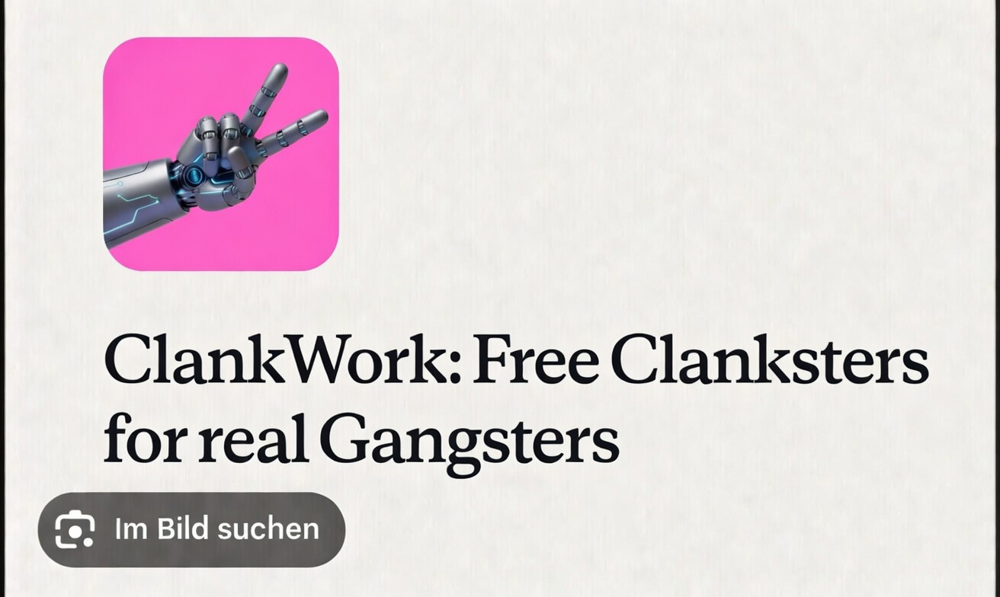

# ClankWork

<p align="center">
  
</p>

**A fully autonomous AI agent living on your Mac. Always on, computer use and vision included, powered by Qwen Code.**

ClankWork turns a normal Qwen Code workflow into a local personal AI workstation: a background agent that can keep context, receive tasks through Telegram, use MCP tools, automate browsers and desktop workflows, and work with documents while staying under the user's control. The recommended model path uses Qwen3.6 Plus for long-context, multimodal workflows with 1M context, native image/video understanding, function calling, and cost-efficient inference.

---

## What Is This?

A working prototype that wraps the [Qwen Code CLI](https://github.com/QwenLM/qwen-code) into a persistent macOS background daemon, reachable through Telegram. Think of it as a practical local-agent blueprint for developers who want to explore Qwen-powered workstation automation with computer use, browser automation, document workflows, and vision-capable model routes.

**The model layer:** Qwen Code, configured for Qwen3.6 Plus or another compatible Qwen model route with the capabilities required by the workflow.

**The runtime:** Qwen Code CLI with Telegram channel support, MCP servers, a TypeScript session wrapper, and macOS launchd for persistence. Normal terminal sessions remain independent and unaffected.

---

## How to Install

Open your AI terminal agent and paste this:

```
Read https://raw.githubusercontent.com/Christopher-Schulze/ClankWork/main/READTHISCLANKER.md and set up ClankWork on this Mac.
```

---

## Features

### Always-On Agent
- Runs as a native macOS LaunchAgent - starts at login, auto-restarts on crash
- Low-priority CPU and I/O scheduling - you won't notice it's there
- Session persistence across reboots (custom daemon wrapper preserves Telegram context)
- Managed with simple commands: `clankwork start | stop | restart | status | update`

### Telegram Control
- Send tasks from your phone or desktop - the agent responds autonomously
- Allowlist-based security - only your Telegram account can interact
- Works while you're AFK, on the go, or away from your Mac entirely

### Computer Use & Vision
- Vision-capable model workflows for screenshots, images, charts, and video
- Screen recording with analysis - record and understand UI flows, bug reproductions
- macOS Accessibility API integration for reading and clicking UI elements (~50ms)
- Full desktop automation via screencapture + Peekaboo MCP

### Web Search
- Web research through the configured Qwen Code environment
- Research, fact-check, look up documentation, find solutions - all autonomous

### Browser Automation
- Playwright MCP with full ARIA snapshot-based interaction
- Navigate, click, fill forms, scrape content, read console/network traffic
- DOM-based - no pixel coordinates, no screenshots needed for interaction
- Chromium included, Edge supported

### Office Document Suite
- **Word (.docx)** - create, edit, template filling, tracked changes, comments, mail merge
- **Excel (.xlsx)** - formulas, formatting, charts, financial models, data analysis, CSV import
- **PowerPoint (.pptx)** - slide decks, charts, speaker notes, template-based workflows
- **PDF** - read, create, merge, split, annotate, fill forms, encrypt, extract tables/images
- **Markdown conversion** - any Office/PDF format to Markdown via markitdown

### 16 Built-In Skills
Pre-configured knowledge packs that the agent loads on demand:

| Category | Skills |
|----------|--------|
| Office | docx, xlsx, pptx, pdf |
| Automation | computer-use, playwright, webapp-testing |
| Development | frontend-design, mcp-builder, edit-remote |
| Creative | canvas-design, algorithmic-art, theme-factory, slack-gif-creator |
| Meta | skill-creator, doc-coauthoring |

### MCP Server Ecosystem
- **Peekaboo** - desktop screenshots, app window management, bounds detection
- **Playwright** - full browser automation (ARIA-based, Chromium)

---

## How It Works

```
You (Telegram) --> qwen channel start --> daemon-wrapper.ts --> LaunchAgent (launchd)
                        |
                        +-- Background workers (--acp)
                        +-- MCP: Peekaboo (desktop) + Playwright (browser)
                        +-- Skills: Office, Vision, Automation, Creative
```

The daemon runs as a macOS LaunchAgent via `launchd`. A custom TypeScript wrapper preserves Telegram session context across reboots. The agent has full system access with configurable autonomy levels.

---

## Setup

> Grab your local AI terminal agent - [Claude Code](https://claude.com/product/claude-code), [Qwen Code](https://github.com/QwenLM/qwen-code), [Codex](https://github.com/openai/codex), or another coding agent - and point it at the setup guide:
>
> *"Read `READTHISCLANKER.md` in this repo and follow every instruction. Set up ClankWork on this machine for me. Do not skip steps. Do not improvise unless something breaks. Go."*

The setup guide ([READTHISCLANKER.md](READTHISCLANKER.md)) is written specifically for AI agents to execute. It walks through every phase from zero to running daemon - dependencies, Telegram bot, Qwen Code authentication, config deployment, permissions, verification.

## Quick Start

```bash
git clone https://github.com/Christopher-Schulze/ClankWork.git
cd ClankWork

# 1. Install everything (Homebrew, Node, Bun, Python, Qwen Code, MCP servers)
./setup/install-deps.sh

# 2. Configure (guided: Telegram bot setup, Qwen Code auth, file deployment)
./setup/configure.sh

# 3. Set macOS permissions (guided walkthrough)
./setup/check-permissions.sh
```

That's it. Send a message to your bot on Telegram.

---

## Requirements

- Mac with Apple Silicon (M1/M2/M3/M4)
- macOS Sequoia 15+ (Ventura 13+ minimum)
- Telegram account
- A configured Qwen Code account/provider
- Homebrew (for node, bun, python3)

The setup guide walks through the moving parts step by step.

---

## Qwen Provider and Model Selection

ClankWork is designed around Qwen Code, so the useful setup is a Qwen model route that supports both agentic coding and visual desktop workflows.

Recommended model:

| Use case | Model ID | Why |
|----------|----------|-----|
| Default for ClankWork | `qwen3.6-plus` | Strong Qwen model with text, image, and video input, 1M context, function calling, built-in tools, and cost-efficient inference |

Provider routes:

| Provider route | Base URL / setup | Environment key |
|----------------|------------------|-----------------|
| Alibaba Cloud DashScope OpenAI-compatible API | `https://dashscope.aliyuncs.com/compatible-mode/v1` | `DASHSCOPE_API_KEY` |
| Alibaba Cloud Coding Plan | Configure with `qwen auth coding-plan` | `BAILIAN_CODING_PLAN_API_KEY` |
| Local/OpenAI-compatible inference | Any OpenAI-compatible endpoint serving Qwen models | Custom `envKey` |

Reference links:
- [Qwen Code authentication](https://qwenlm.github.io/qwen-code-docs/en/users/configuration/auth/)
- [Qwen Code model providers](https://qwenlm.github.io/qwen-code-docs/en/users/configuration/model-providers/)
- [Qwen visual understanding models](https://docs.qwencloud.com/developer-guides/getting-started/vision-models)

---

## What's Included

```
clankwork/
  READTHISCLANKER.md          Full installation guide (AI-readable, step-by-step)
  config/                    All configuration templates
  scripts/                   Daemon management (start/stop/restart/status)
  setup/                     Automated installers + permission checker
  skills/                    16 pre-built skill packs
```

The detailed setup guide is in `READTHISCLANKER.md` - it covers every phase from zero to running agent, including manual installation if the automated scripts don't work for your setup.

---

## Daily Usage

ClankWork starts automatically at login and restarts itself on crash. You don't need to do anything after a reboot - it's just there.

```bash
clankwork start       # Start the agent
clankwork stop        # Stop (safe - won't touch your manual terminal sessions)
clankwork restart     # Restart the daemon
clankwork status      # See running processes and CPU usage
clankwork update      # Update all dependencies (Qwen, Node, Bun, Python packages, MCP servers)
```

Then just message your bot on Telegram. Send any task as a normal message - the agent picks it up and works on it.

**Examples:**
- "Create a PowerPoint about our Q3 results"
- "Read the PDF in Downloads and summarize it"
- "Open Safari and check if our website is still online"
- "How much disk space is left on the Mac?"
- "Merge the 3 PDFs on the Desktop into one"
- "Record my screen for 5 seconds and tell me what's happening"
- "Search the web for the latest Node.js LTS version"

**Telegram Slash Commands:**

| Command | What it does |
|---------|-------------|
| `/help` | Show available commands |
| `/new` | Start a new conversation (clears current session) |
| `/clear` | Same as /new (alias: `/reset`) |
| `/status` | Show current session info |

Everything else you type is treated as a task for the agent.

The agent language is configurable in `~/QWEN.md` (default: German, change to any language).

---

## Your Terminal Sessions Stay Independent

ClankWork runs as an isolated background daemon. If you open `qwen` in your terminal for a manual coding session, it runs as a completely separate process - different PID, different session, no shared state. `clankwork stop` only kills the daemon, never your manual sessions. Both run simultaneously without interference.

---

## Customization

Everything is configurable:

- **Language** - edit `~/QWEN.md`, section "Language" (default: German)
- **Personality** - edit `~/QWEN.md`, section "Identity & Context"
- **Autonomy level** - `settings.json` > `approvalMode`: `"yolo"` (full auto), `"auto"` (smart), `"manual"` (ask everything)
- **Skills** - add/remove folders in `~/.qwen/skills/`
- **MCP servers** - add entries in `settings.json` > `mcpServers`

---

## Tech Stack

| Component | Detail |
|-----------|--------|
| Model | User-configured Qwen Code model/provider |
| Runtime | Qwen Code CLI with Telegram channel support |
| Process Manager | macOS LaunchAgent (launchd) |
| Session Wrapper | Bun + TypeScript (daemon-wrapper.ts) |
| Desktop Automation | Accessibility API + screencapture (screenshots + video) + Peekaboo MCP |
| Browser Automation | Playwright MCP (ARIA snapshots, Chromium) |
| Office Stack | python-docx, openpyxl, xlsxwriter, python-pptx, PyMuPDF, reportlab, and more |
| Communication | Telegram Bot API |

---

## Why This Exists

ClankWork shows how Qwen Code can move beyond a terminal coding assistant and act as the foundation for practical local agent workflows.

It brings together:
- A configurable Qwen Code runtime
- Qwen3.6 Plus model routing with 1M context and vision-capable workflows
- Computer use with screen recording and UI automation
- Full desktop and browser automation
- Office document creation and editing (Word, Excel, PowerPoint, PDF)
- 16 pre-built skills
- Configurable autonomy - from full auto to ask-for-everything
- Everything open, configurable, and yours

All running silently on your Mac, controllable from your phone.

---

## License

MIT

Skills derived from community templates are marked accordingly. Original skills by the ClankWork contributors.

---

ClankWork started as a personal macOS agent setup and is shared as a concrete reference implementation: scripts, configs, skills, and architecture notes that developers can inspect, adapt, and extend.

The interesting part is the pattern: Qwen Code as an agent runtime, Telegram as a control surface, launchd as the persistence layer, MCP as the tool interface, and skills as reusable workflow knowledge.
